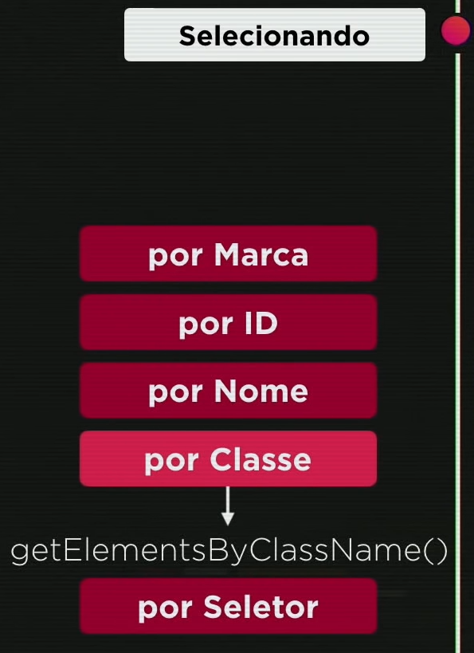
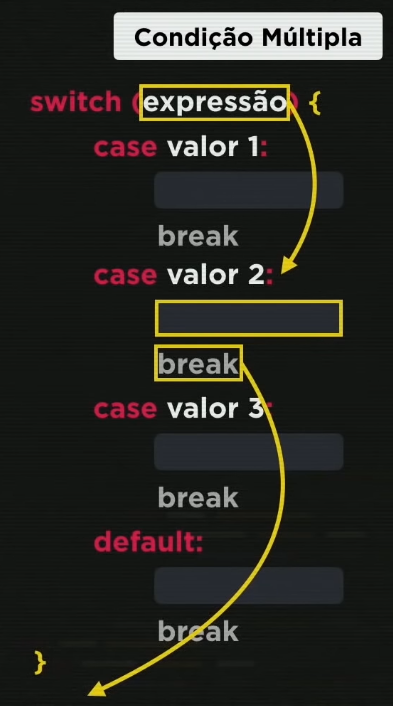

# CursoJS

Curso de JavaScript - CursoemVideo(Gustavo Guanabara)

---

## Módulo A: Conhecendo o JavaScript

---

### Aula 01 - O que o JavaScript é capaz de fazer?

Nesta aula, o professor explica as capacidades do JavaScript na programação. Ele começa explicando a diferença entre cliente e servidor: o cliente é aquele que utiliza um navegador web para acessar a infraestrutura da internet (nuvem), enquanto o servidor é responsável por armazenar e fornecer os arquivos solicitados pelo cliente. Dessa forma, quando o cliente procura um arquivo, o servidor envia uma cópia para que o cliente possa visualizá-lo ou até mesmo modificá-lo em sua própria máquina (computador).  
 
O professor também faz uma comparação entre as três tecnologias fundamentais da web: *HTML*, *CSS* e JavaScript. Ele as compara a profissionais trabalhando na criação de um jornal, com o *HTML* sendo o jornalista responsável pelo conteúdo textual, imagens e vídeos. O *CSS* sendo o designer, responsável pela aparência visual, como cores, tamanhos e disposição dos elementos. E o JavaScript como o programador, encarregado da estruturação e segurança do jornal para que ele possa ser entregue adequadamente.  
 
É importante notar que sites populares como [Google](https://www.google.com.br/ "Google"), [YouTube](https://www.youtube.com/ "YouTube"), [LinkedIn](https://www.linkedin.com/ "LinkedIn"), [Netflix](https://www.netflix.com/br/ "Netflix"), [Facebook](https://pt-br.facebook.com/ "Facebook") e [Amazon](https://www.amazon.com.br/ "Amazon") usam o JavaScript em sua infraestrutura, mostrando a ampla adoção e importância dessa tecnologia na web.  
 
Também utilizamos comandos no console do navegador para fazer alterações na página inicial do Google.  

---

### Aula 02 - Como chegamos até aqui?

Perguntas iniciais:
1. Sabe a diferença entre um cliente e um servidor para a Internet?
2. Para que serve HTML, CSS e JavaScript?
3. Cite 4 sites que fazem uso do JavaScript.

Nesta aula, aprendemos sobre a história resumida do JavaScript. Durante a Guerra Fria, em 1970, o presidente dos EUA criou uma agência de pesquisa tecnológica, DARPA, que desenvolveu a rede Arpanet para garantir a segurança dos dados dos servidores em caso de eventuais ataques. Com o passar do tempo, a rede cresceu com a entrada de faculdades, como o MIT e a Universidade da Califórnia, e pequenas redes, mudando de nome e se tornando a Internet.  
 
Em 1993, foi criado o *HTML* e o protocolo *HTTP*, que se juntaram ao *TCP/IP* e à *WWW*, e para que essas tecnologias funcionassem, foi criado um navegador chamado Mosaic. Em 1994, a Netscape criou um navegador baseado no Mosaic, que se tornou o navegador mais popular da época.  
 
Em 1995, foi criado o JavaScript, cujo nome foi uma jogada de marketing, pois a palavra "Java" estava em alta na época, devido ao Java ser considerado a linguagem do futuro. Em 1997, a Netscape procurou a *ECMA*, uma empresa de padronização, e surgiu o ECMAScript.  
 
Por volta de 2002, a Netscape faliu, e um grupo dentro dela criou a fundação Mozilla, que hoje é conhecida pelo navegador Firefox. Em 2008, foi criado o Google Chrome, que se tornou muito popular e com o tempo foi se modernizando, surgindo o seu motor interno chamado V8 em 2009.  
 
Um grupo pegou o código do motor interno do Google, que era um código aberto, e modificou-o para que não fosse necessário utilizar um navegador, criando o Node.js em 2010.  
  
Linha do Tempo  

---

### Aula 03 - Dando os primeiros Passos.

Perguntas iniciais:
1. Sabe que empresa criou o JavaScript?
2. Java e JavaScript possuem alguma relação?
3. O que ECMAscript tem a ver com JavaScript?
4. Sabia que o programa WhatApp desktop é criado em JavaScript?

Durante a aula, o professor fez uma comparação interessante. Assistir vídeos de pessoas tocando violão não te torna um músico habilidoso, assim como assistir vídeos de manobras de bicicleta não vai te ensinar a realizá-las sem se machucar. O mesmo princípio se aplica à programação: é preciso praticar e colocar a mão na massa para realmente aprender. Existem diversas maneiras de aprender, como listado abaixo:
 
- Ver vídeos.
- Praticar o que foi mostrado nos vídeos.
- Ler conteúdo, documentação e manuais. exemplo:
    - JavaScript: O Guia Definitivo.
    - JavaScript - Guia do Programador.
    - [Guia JavaScript - MDN Web Docs.](https://developer.mozilla.org/pt-BR/docs/Web/JavaScript)
    - [ECMA](https://www.ecma-international.org/publications-and-standards/standards/ecma-262/)
- Anotações com caderno ou bloco de notas.
- Interações com pessoas, conversar sobre oque foi ensinado.
- Pensar em projetos próprios, resolver problemas do dia a dia, aplicar a ferramente de programação para resolver o problema.

Programas instalados:
- [Google Chrome](https://www.google.com/intl/pt-BR/chrome/)
- [Visual Studio Code](https://code.visualstudio.com/download)
- [Node.js](https://nodejs.org/en/download)

---
### Aula 04 - Criando o seu primeiro script

Perguntas iniciais:
1. Que livros/documentos nós recomendamos?
2. Para aprender JS, precisamos saber inglês?
3. Que dicas nós demos para quem quer estudar?
4. Quais programas nós intalamos no computador?

Nessa aula desenvolvemos os primeiros scripts feitos em JavaScript.  
 
Criamos uma pasta chamada "CursoJS" que contém um arquivo HTML denominado "ex001.html" para inserir um script de maneira simples em uma página HTML. Durante a aula, o professor explicou de forma básica os elementos HTML, como as tags "head" (cabeçalho) e "body" (corpo). Além disso, utilizamos as tags `<h1>` para título e `
` para parágrafos. Também incluímos uma seção `` para colorir o corpo do documento e formatar sua fonte. No final da tag `<body>`, adicionamos uma seção `` para inserir os seguintes códigos:

Para exibir uma mensagem no navegador:
 
`window.alert('Minha primeira mensagem!');`

Para exibir uma caixa de confirmação:
 
`window.confirm('Está gostando de JS?');`

Para permitir que o usuário digite seu nome:
 
`window.prompt('Qual é o seu nome?');`

---
## Módulo B: Comandos Básicos do JavaScript

---

### Aula 05 - Variáveis e Tipos Primitivos

Perguntas iniciais:
1. Já sabe organizar suas pastas com VSCode?
2. O Node.js está instalado no seu computador?
3. Sabe diferenciar HTML5, CSS3 e JS dentro de um código?
4. Sabe disparar alertas, confirmações e perguntas?

Aprendemos sobre comentar em códigos e como criar as variáveis e seus funcionamentos.

Para comentar um código usamos // ou /* */ o primeiro para linha de código e o segundo para um bloco de código.

Para identificadores seguem os passos abaixo para nomear as variáveis:

* Podem começar com **letra**, **$** ou **_**
* Não podem começar com **números**
* É possível usar **letras** ou **números**
* É possível usar **acentos** e **símbolos**
* Não podem conter **espaços**
* Não podem ser palavras reservadas tipo function, alert e outras que o JS usa como comandos.

Dicas!

* Maiúsculas e minúsculas fazem diferença:

var a = 10 
var A = 20 
a = 10 
A = 20 

* Tente escolher nomes coerentes para as variáveis

Como fazer

nome = nome de alguma pessoa
idade = idade da pessoa

Como não fazer

idade = ano de nascimento
nome = sobrenome

* Evite se tornar um **programador alfabeto** ou um **programador contador**

* tipos de dados

number 
5 18 -12 
0.5 -15.9 3.14 8.0

string 
"Google" 
'JavaScrip' 
`Maria`

boolean 
true 
false

Temos outros tipos de dados que iremos falar mais para frente, infinity, NaN, null, undefined, object, array, function.

---

### Aula 06 - Tratamento de dados

Perguntas iniciais:
1. O que é uma variável?
2. Como declarar uma variável numérica Inteira ou Real usando JS?
3. Quais são os tipos primitivos do JS?
4. O que significa colocar o valor null dentro de uma variável?

Temos alguns tipos de dados na imagem abaixo:

Nesta aula, aprendemos sobre diferentes conceitos e técnicas importantes. Inicialmente, exploramos como armazenar a resposta de uma variável em uma pergunta feita pelo usuário através do navegador. Além disso, foi ensinado o uso da concatenação para combinar strings e números, bem como a realização de cálculos através da soma de números. Também abordamos as formas de conversão de números para inteiros e números reais, assim como a conversão de números em strings.

Um dos tópicos principais da aula foi o uso de template strings, que facilitam a digitação e compreensão do código. Com eles, podemos inserir variáveis diretamente nas strings de forma mais conveniente.

Exploramos também algumas operações com strings, como a contagem de letras e a conversão entre maiúsculas e minúsculas. Ademais, aprendemos a escrever pequenas frases de código no documento HTML e até mesmo como adicionar um valor monetário a uma variável, utilizando o símbolo "R$" e substituindo o ponto decimal por vírgula, se necessário.

---

### Aula 07 - Operadores (Parte 1)

Perguntas iniciais:
1. Como é possível guardar o valor digitado em um prompt() dentro de uma variável?
2. Como fazer com que um número digitado em um prompt() possa ser usado em cálculos?
3. Como transformar um texto todo para letras MAIÚSCULAS?
4. Como mostrar um número formatado como um valor monetário?

Nesta aula o professor ensinou a usar os operadores aritméticos e de atribuição.

Segue imagem com os operadores aritméticos usados.

Segue algum exemplos usando os operadores aritméticos.

Na imagem abaixo é mostrado a precedência de cálculo de cima para baixo, onde () é realizado primeiro, ** em segundo e assim por diante.

Nesta imagem temos como guardar um valor em uma variável e usar esse valor para realizar outros cálculos.

Na imagem abaixo temos as auto-atribuições, elas servem muito para atualizar um valor em algum tipos de loops, mas não é apenas essa a utilidade dela.

Podemos simplificar as auto-atribuições usando a fórmula mais a direita da imagem.

Uma maneira de simplicar ainda mais as auto-atribuições e é usando a fórmula mais a direita da imagem.

---

### Aula 08 - Operadores (Parte 2)

Perguntas iniciais:
1. Para que serve o operador **%** em JS? Seria para calcular porcentagem?
2. 6 + 4 / 2 é igual a 5 ou 8?
3. Se uma variável n está valendo 10 e executamos um n += 5, qual será seu novo valor?
4. Para que servem os operadores ++ ou --

Nesta aula o professor ensinou a usar os operadores relacionais, lógicos e ternário.

Estes são os operadores relacionais.

Podemos usar os sinais de identidade para comparar dados e saber se são iguais ou não.

Exemplos de operadores lógicos.

Negação

Conjunção

Disjunção

Usando operadores lógicos e relacionais.

Esta imagem abaixo tem a ordem de precedência realizada pela máquina, onde ela realiza primeiro os operadores aritméticos onde dentro dos operadores Aritméticos há sim precedência também, depois ela realiza os operadores Relacionais que não tem precedência interna e por último os operadores Lógicos que tem sim sua precedência interna como o de negação, conjunção(e) e disjunção(ou).

Esta é uma imagem de como os operadores ternários funcionariam.

Abaixo imagem com exemplo.

---

## Módulo C: Entendendo o DOM

---

### Aula 09 - Introdução ao DOM

Perguntas iniciais:
1. Qual é a diferença entre usar =, == e === em códigos escritos em JS?
2. Em uma mesma expressão, temos os operadores || e &&. Quem eu resolvo primeiro?
3. Sabe usar o operador ternário para colocar um entre dois valores em uma variável?

O que é o DOM?

O Document Object Model (DOM) é uma interface de programação para os documentos HTML e XML. Representa a página de forma que os programas possam alterar a estrutura do documento, alterar o estilo e conteúdo. O DOM representa o documento com nós e objetos, dessa forma, as linguagens de programação podem se conectar à página.

Abaixo um exemplo de Árvore DOM.

Existe maneiras de selecionar os objetos dentro de um documento HTML abaixo algumas formas que iremos aprender a selecionar os objetos.

---

### Aula 10 - Eventos DOM

Perguntas iniciais:
1. O que significa a sigla DOM?
2. Sabe montar a árvore DOM de um website simples?
3. O que são os elementos Parent e os elementos Child em uma árvore DOM?
4. Quais são os cinco principais métodos de selecionar elementos DOM dentro do JS?

Nesta aula aprendemos alguns eventos em DOM, na imagem abaixo temos alguns dos eventos porém há muitos tipos de eventos.

---

## Módulo D: Condições em JavaScript

---

### Aula 11 – Condições (Parte 1)

Perguntas iniciais:
1. Consegue citar três eventos que podem acontecer com elementos DOM de um site?
2. O que é uma função? Como criar funções em JS?
3. Sabe como pegar os valores de caixas de texto e fazer cálculos com eles?

Nesta aula começamos a aprender sobre condições e abaixo temos uma foto exemplificando como seria uma condição

Tipos de condição

---

### Aula 12 – Condições (Parte 2)

Perguntas iniciais:
1. Já sabe como usar a extensão Node Exec no VSCode?
2. Sabe criar uma condição em seu programa JS?
3. Consegue diferenciar condições simples e as condições compostas?

Aprendemos na aula anterior condições simples e compostas.

Nesta aula iremos aprender sobre Condições Aninhadas. Que tem uma estrutura parecida com a imagem abaixo.

Também temos a Condição Múltipla como imagens abaixo.

---

### Exercícios JavaScript(Parte 1, 2 e 3) - Curso JavaScript

Nesta aula criamos a pasta aula12ex para criar o modelo dos arquivos HTML, CSS e JS para poder praticar os exercícios criados pelo professor nas próximas aulas de exercícios.

---

## Módulo E: Repetições em JavaScript

---

### Aula 13 – Repetições (Parte 1)

Perguntas iniciais:
1. Sabe mudar a cor de fundo de um site **dinamicamente**, usando JS?
2. Consegue inserir uma imagem dentro do seu site sem ter a tar **img** previamente criada?
3. Já treinou bastante o uso de **condições simples**, **compostas**, **aninhadas** e **múltiplas**?

Nesta aula aprendemos sobre testes lógicos de repetição no inicio e no final como as imagens abaixo

---

### Aula 14 – Repetições (Parte 2)

Perguntas iniciais:
1. O que faço se quiser fazer uma determinada atividade acontecer **várias vezes**?
2. Sabe diferenciar as estruturas de **condição** e as estruturas de **repetição**?
3. Consegue dizer a diferença entre as estruturas **while** e a **do..while**?

Aprendemos a usar a estrutura de repetição for e a usar o depurador do VSCode.

---

### Exercícios JavaScript(Parte 4, 5 e 6) - Curso JavaScript

Perguntas iniciais:
1. Já aprendeu a usar direito a extensão **Watch in Chrome** no **VSCode**?
2. Já aprendeu a usar o **Modo de Depuração** do VSCode?
3. Já fez todos os testes com as estruturas **while**, **do...while** e **for**?
4. Quer aprender um pouco mais como manipular dados em **controles HTML** com JS?

---

#### Siglas:

HTML: Linguagem de Marcação de HiperTexto - HyperText Markup Language

CSS: Folha de Estilo em Cascatas - Cascading Style Sheets

MIT: Instituto de Tecnologia de Massachusetts - Massachusetts Institute of Technology

HTTP: Protocolo de Transferência de Hipertexto - Hypertext Transfer Protocol

TCP/IP: Protocolo de Controle de Transmissão - Transmission Control Protocol / Protocolo de Internet - Internet Protocol

WWW: Rede Mundial de Computadores - World Wide Web

ECMA: Associação Européia dos Fabricantes de Computadores - European Computer Manufacturers Association

